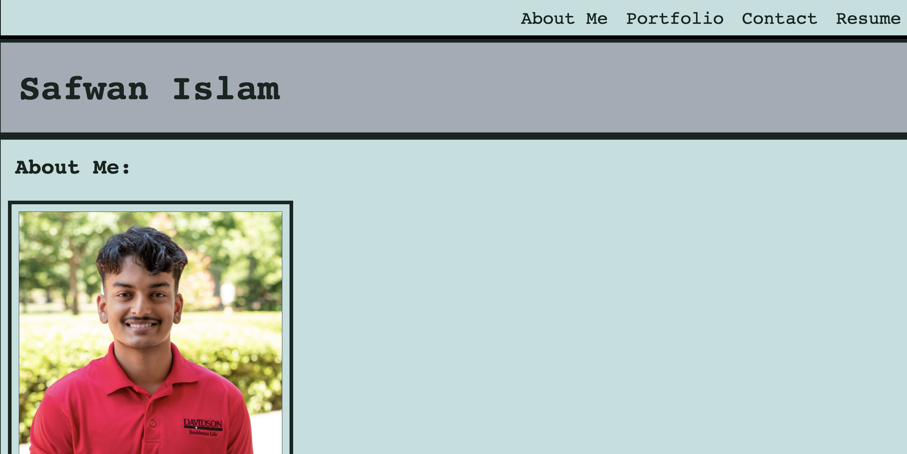

# React Portfolio

## Table of Contents 
1. [Description](#description)
2. [Visuals](#visuals)
3. [Resources](#resources)

## Author:

Safwan Islam

## Description
This portfolio is created using react.js using state handling. There are four sections: About Me, Portfolio, Contact, and Resume. The user can click to each of these and it will route them to the specific section. The About Me section has a picture of me and a small description of myself. The portfolio has my two projects with clickable links to the live site and repository. The contact section has name, email, and message sections in order to contact me. The resume section has some of my skills. There is also a footer section which has links to my linkedin and github. The picture below shows a bit of the About Me page, scroll below and access the live link for more!

## Visuals

## Resources
[LIVE SITE](https://shrouded-spire-37782.herokuapp.com/)

[Repository](https://github.com/saislam10/react-portfolio)